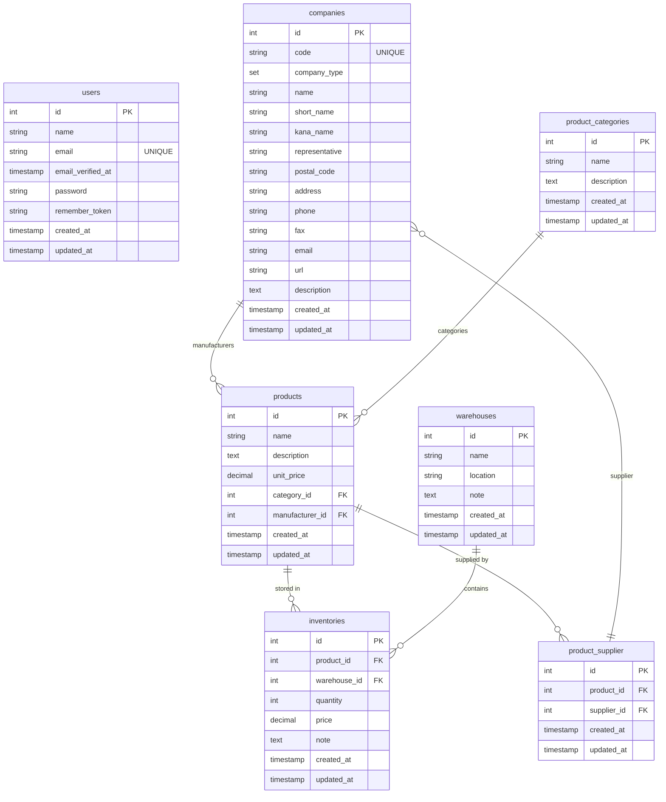

# ER図

```mermaid
erDiagram
    users {
        int id PK
        string name
        string email "UNIQUE"
        timestamp email_verified_at
        string password
        string remember_token
        timestamp created_at
        timestamp updated_at
    }
    companies {
        int id PK
        string code "UNIQUE"
        set company_type
        string name
        string short_name
        string kana_name
        string representative
        string postal_code
        string address
        string phone
        string fax
        string email
        string url
        text description
        timestamp created_at
        timestamp updated_at
    }
    product_categories {
        int id PK
        string name
        text description
        timestamp created_at
        timestamp updated_at
    }
    products {
        int id PK
        string name
        text description
        decimal unit_price
        int category_id FK
        int manufacturer_id FK
        timestamp created_at
        timestamp updated_at
    }
    product_supplier {
        int id PK
        int product_id FK
        int supplier_id FK
        timestamp created_at
        timestamp updated_at
    }
    inventories {
        int id PK
        int product_id FK
        int warehouse_id FK
        int quantity
        decimal price
        text note
        timestamp created_at
        timestamp updated_at
    }
    warehouses {
        int id PK
        string name
        string location
        text note
        timestamp created_at
        timestamp updated_at
    }

    companies ||--o{ products : "manufacturers"
    product_categories ||--o{ products : "categories"
    products ||--o{ inventories : "stored in"
    products ||--o{ product_supplier : "supplied by"
    product_supplier ||--o{ companies : "supplier"
    warehouses ||--o{ inventories : "contains"
```
